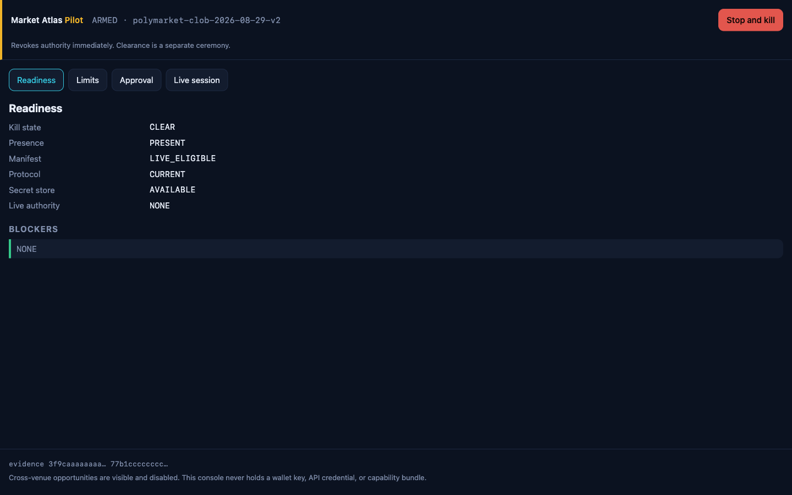
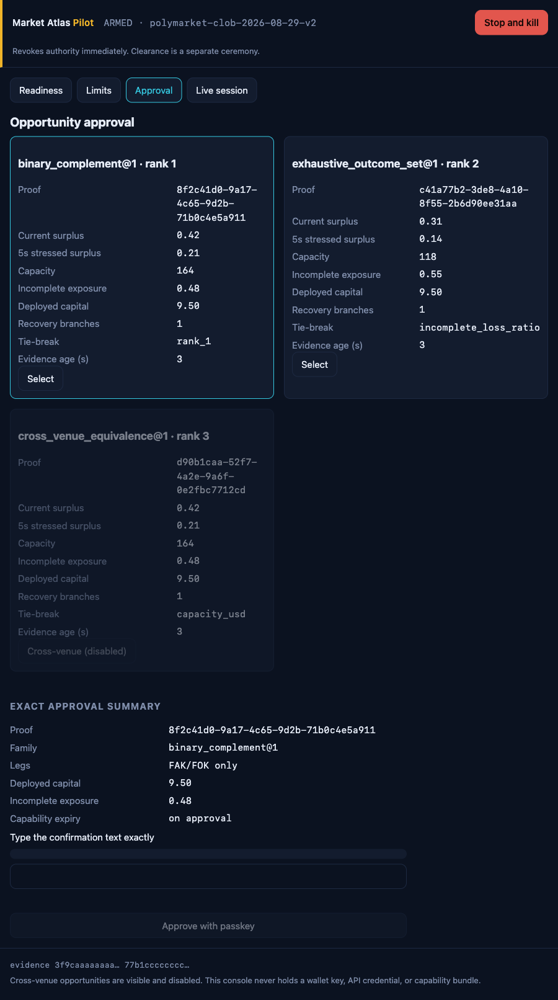
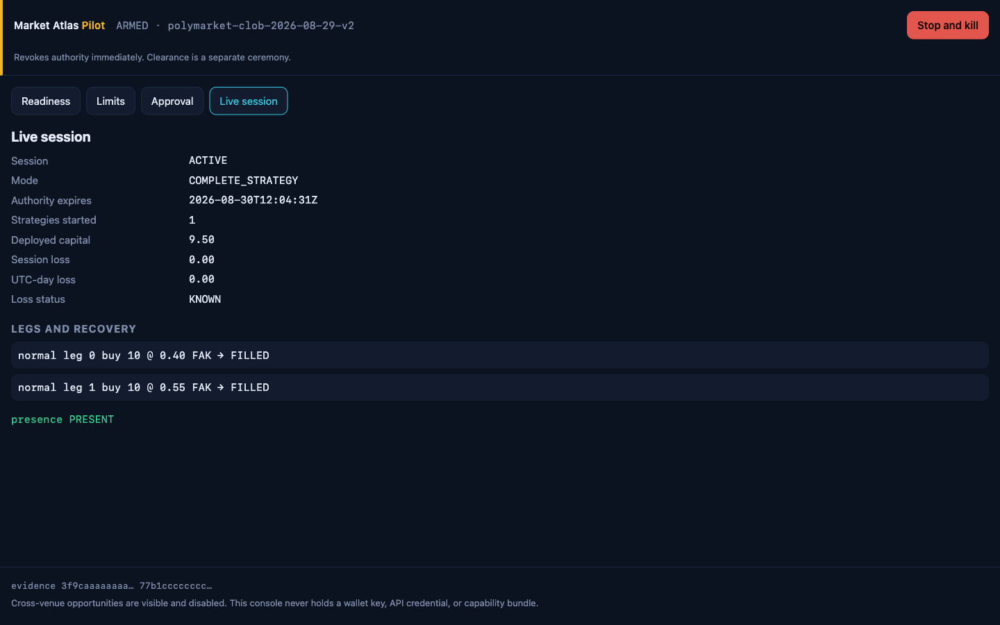
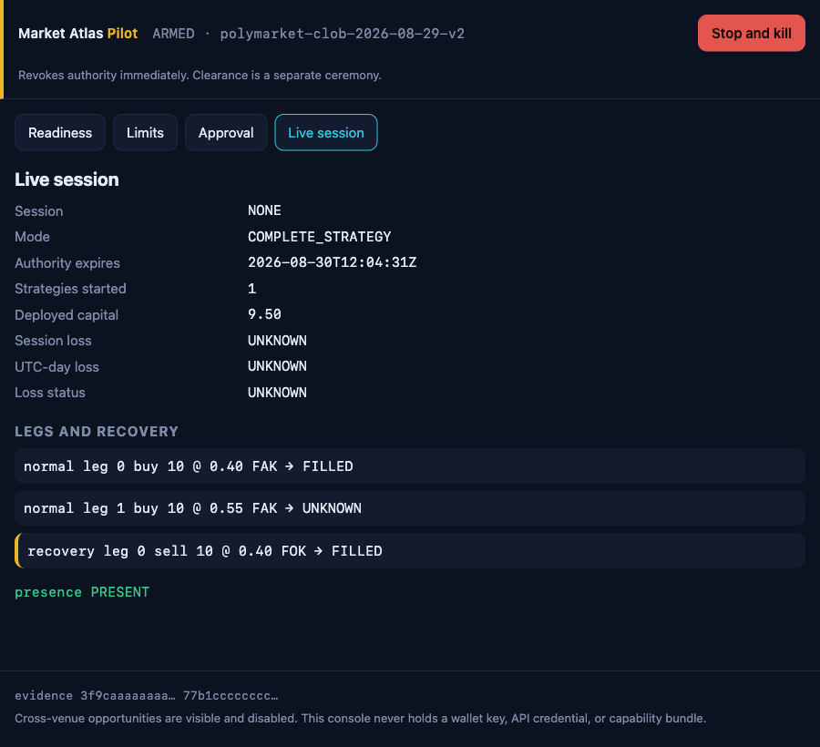
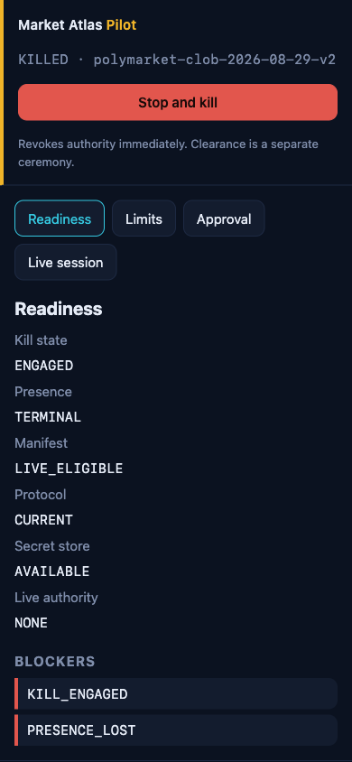

# Polymarket local live pilot — operator runbook

This runbook records the evidence and recovery ceremony for a separate, explicitly approved
loopback-only pilot. The repository includes a signer-owned authenticated venue transport and a
manual exact-order/complete-strategy execution path, but their presence does not authorize use.
Every fresh launch starts killed. Completing local preflight alone creates no capability and makes
no live request.

**Secrets never belong in the UI, the CLI, a `.env` file, logs, screenshots, tickets, chat, email,
or a support message. Never paste a credential or key into a terminal or UI.** The only place a
wallet key or CLOB credential lives is the macOS Keychain and the signer process that reads it
through inherited descriptors.

## 1. Mandatory preflight and first-strategy order

The 45-day qualification, 30-day queue-aware shadow-execution evidence, independent legal/KYC/
venue-terms and jurisdiction/geoblock review, manual funding and allowance, and a separately
approved activation decision are external prerequisites. They are not provided or satisfied by this
repository. The pilot remains killed until every prerequisite and local evidence check is current
and succeeds; no launch, manifest, passkey, or checklist completion creates an execution capability.
No evidence in this repository establishes that those external prerequisites have been completed.

Perform this order exactly:

1. Verify the persisted qualification and shadow evidence, then obtain the independent current
   legal/KYC/venue-terms, eligibility, geoblock, and protocol-review evidence.
2. Unlock the required Keychain entries locally. Do not reveal, copy, paste, or type their values
   into a terminal or the console.
3. Launch the pilot in its killed posture and inspect the clean, exact startup reconciliation.
4. Register and verify the platform passkey.
5. Do not treat the green checks as activation authority. Only a separately approved external
   activation decision may permit the local activation and kill-clearance ceremonies. If any
   evidence is absent, stale, contradictory, or not independently approved, stop and leave the kill
   engaged.
6. Only after that separate approval, manually authorize one bounded, complete strategy through the
   repository path and inspect its authoritative reconciliation before considering any further
   action.
7. Stop and engage/keep the kill on any uncertainty, including an ambiguous acknowledgement,
   signer/transport problem, missing presence, or reconciliation difference.

Automation is unavailable in this build. Do not attempt an automation-session ceremony, API,
script, or workaround; it is deliberately rejected. A manual-first complete-strategy procedure, if
separately approved outside this repository, is not an activation bypass.

## 2. Local setup

1. Create and back up the dedicated wallet **outside this application**. It holds only pilot funds.
2. Enrol the wallet key in the macOS Keychain with the native Keychain interface, under service
   `polytrading.polymarket.pilot` and account `wallet-private-key`. Store the wallet private key as
   exactly 64 hexadecimal characters (an optional `0x` prefix is accepted); the signer decodes it
   to its 32-byte key form. Never use the Pilot UI or CLI to enter a secret, and never use
   `security -w` or a shell helper that prints a secret.
3. Fund the wallet and set the venue allowance manually, outside this application. The pilot never
   deposits, withdraws, transfers, approves, splits, merges, converts, or redeems.
4. Start the console: `predictions pilot polymarket --db <path> --port <port>`. Those two flags are
   the entire CLI surface; there is no credential, order, activation, capability, or kill-clearance
   flag anywhere.
5. If the wallet key is not enrolled or cannot be unlocked, the command writes
   `pilot: signer unavailable (<CODE>); serving posture only` to stderr and serves only the
   read-only killed posture console. It never accepts a secret from the CLI or browser.
6. If the wallet key is available, the signer identifies the wallet and owns all authenticated CLOB
   transport behind the fixed IPC boundary. The console still starts killed. The manual execution
   path remains unauthorized until every external prerequisite, separate activation decision,
   current evidence check, passkey ceremony, and explicit action approval succeeds. The browser,
   coordinator, database, and logs only ever see public fingerprints and sanitized results.

### macOS CLOB credential ceremony

Only the designated operator may run this macOS-only Keychain ceremony. Do not run it in CI, and
do not ask an agent to run it. It is not a console command and does not start or activate the
pilot. The wallet Keychain item is valid only as exactly 64 hexadecimal characters, optionally
prefixed with `0x`; enter it through the native Keychain interface, never a terminal or UI.

Run the local readiness command first:

```bash
.venv/bin/polytrading predictions pilot credentials check
```

The successful output is limited to `wallet_ready=true|false` and
`credentials=PRESENT|ABSENT|PARTIAL`. A refusal emits only a stable public error code. It makes no
external CLOB request and displays no credential material.

Only if the wallet is ready and all three credential slots are absent may the operator deliberately
run:

```bash
.venv/bin/polytrading predictions pilot credentials create --confirm
```

Its successful output is `result=CREATED` plus a public credential fingerprint. This command makes
one real external CLOB credential request, writes the returned values only to the macOS Keychain,
and never trades. It fails rather than overwrites, rotates, or recovery-derives any existing or
partial credential set. Creation preserves every external eligibility, legal/KYC/venue-terms and
geoblock review, manual funding/allowance, 45-day qualification, 30-day shadow-evidence, separate
activation decision, passkey, explicit-action, and killed-by-default gate.

The ceremony locks concurrent `polytrading` create attempts. It cannot coordinate an external
Keychain editor or another program changing those items: close Keychain Access and do not modify
the reviewed items while it runs. On any failure, run `check`, keep the pilot killed, and do not
retry or attempt manual recovery through this product.

## 3. What the console shows



**Readiness** — kill state, presence, manifest posture, protocol checkpoint, secret-store health,
qualified proof families, evidence age and hashes, and a stable blocker code for anything missing.

**Limits** — the compiled immutable ceilings beside the operator's requested values. A request may
only lower a ceiling; an attempted increase is rejected, never clamped.

| Control | Immutable ceiling |
| --- | ---: |
| Dedicated wallet trading equity | USD 250 |
| One order notional | USD 10 |
| One complete strategy gross notional | USD 25 |
| Automation session | Unavailable; deliberately disabled |
| Concurrent active strategies | 1 |
| Session realized plus unrealized loss | USD 5 |
| UTC-day realized plus unrealized loss | USD 10 |



**Approval mockup** — a fake-data rendering of a separately approved pilot's strategy review, with
proof, legs, FAK/FOK types, current and
five-second-stressed surplus, executable capacity, modeled incomplete-leg exposure, recovery
branches, evidence age, rank, and the first ranking field that broke the tie. Cross-venue
opportunities remain visible and disabled.



**Live-session mockup** — fake-data rendering only; it does not indicate a live session exists in
this repository. Any future pilot would show mode, authority expiry, presence heartbeat, strategies
started, deployed capital, and loss budgets, with financial totals unavailable until reconciliation
is exact.





Screenshots come from the fake-data pilot server: no database, signer, keychain, or authenticated
transport is involved in producing them.

## 4. Concepts worth reading once

- **Proof families.** Only deterministic, exhaustive proofs are live-eligible: binary complement,
  exhaustive outcome coverage, implication, and within-Polymarket equivalence. AI may nominate a
  relationship for deterministic evaluation; it can never prove, rank, size, approve, or execute.
- **FAK and FOK only.** Post-only, GTC, GTD, passive quoting, and resting strategies are refused at
  the UI, plan, coordinator, signer, and route boundaries.
- **UNKNOWN.** A timeout or ambiguous acknowledgement is UNKNOWN. The order POST is never retried.
  Normal execution stops and only the frozen risk-reducing recovery branch remains available.
- **Reconciliation.** P&L stays unavailable until venue, settlement, balance, allowance, position,
  and ledger agree exactly.

## 5. Manual authorization modes remain externally gated

The repository implements these constrained manual modes, but a fresh launch exposes no authority.
They remain unusable unless the external 45-day/30-day, legal/KYC/venue-terms, geoblock, manual
funding/allowance, and separate activation prerequisites have all been satisfied and remain current.

**Exact order**, when separately activated, authorizes one precomputed FAK/FOK order that reduces a
known existing position. It cannot open naked or directional exposure. The capability dies at the
reconciled terminal result or after 60 seconds, whichever comes first.

**Complete strategy**, when separately activated, authorizes one precomputed multi-leg strategy and
its bounded recovery tree. The plan, leg order, sizes, prices, deadlines, and stop conditions are
frozen before the passkey ceremony. The capability dies at reconciliation or after five minutes.

**Automation session is unavailable.** It is compiled disabled and its requests are rejected. No
operator may substitute repeated approvals, a script, or another UI path for the manual-first
complete-strategy ceremony.

A separately approved pilot's manual approval requires reading the summary, typing the exact
confirmation text (`ORDER <amount> USD` or `STRATEGY <amount> USD`), then satisfying the platform
passkey. The console never marks success optimistically; it re-reads current reconciliation,
account, geoblock, presence, and authority evidence and refuses the action if any check changes or
fails.

## 6. Presence

The page sends a heartbeat every two seconds. Two missed heartbeats, five seconds of silence, a
screen lock, or a sleep-sized jump in the monotonic clock engages the kill state immediately. The
control page must stay open, the machine awake, and the operator present.

## 7. Checklists

**Before a separately approved external pilot authorizes**
- Verify the persisted 45-day qualification and 30-day shadow-execution evidence before opening
  the Keychain or console.
- Confirm current eligibility, KYC, jurisdiction/geoblock, and protocol-review evidence; readiness
  shows no blockers and evidence age is seconds, not minutes.
- Startup reconciliation is exact. Funding and allowance were performed manually outside the app.
- The passkey has been registered and verified after the clean killed launch.
- The requested limits are the ones you intend, and are at or below every ceiling.
- The summary's legs, prices, sizes, and recovery branches are what you expect.
- You are physically present and the machine will stay awake.
- The separately approved operator chooses one bounded complete strategy manually; automation is
  not an alternative. The repository path does not make the separate external approval optional.

**After a run**
- Every leg has an authoritative terminal result; nothing is UNKNOWN.
- Reconciliation is exact and the ledger balances.
- Deployed capital and losses are inside the session and UTC-day budgets.
- If anything is off, stop, leave the kill engaged, and work through section 9.

## 8. External staged-activation requirements

None of these stages alone authorizes a live request. The listed evidence and the final activation
decision are external prerequisites to any separately approved use of the repository path.

- **Stage 0 — offline verification.** Full suite, conformance, and authority scans pass.
- **Stage 1 — shadow qualification.** 45 continuous days of synchronized rules and executable books
  plus 30 additional days of queue-aware shadow execution, recomputed from persisted evidence per
  proof family. Thresholds are never edited to fit results.
- **Stage 2 — operator drills.** Practise stop, kill, recovery, and clearance with no live
  authority.
- **Stage 3 — activation readiness.** Current account eligibility, KYC, geoblock, protocol review,
  manual funding/allowance, exact killed-launch reconciliation, and a verified passkey must all be
  present. A `LIVE_ELIGIBLE` manifest creates no capability and submits nothing.
- **Stage 4 — first live strategy.** Only after every external gate remains current and the separate
  activation decision is approved, the present operator could manually authorize one bounded complete
  strategy. Keep the first live size at `min(USD 5, the smallest venue-valid complete strategy)`.
  Automation remains unavailable; only the signer-owned, manual execution path exists.

## 9. Recovery playbooks

- **UNKNOWN order outcome.** Do not retry. Let recovery run its frozen branch, then reconcile from
  authoritative order, trade, balance, and allowance reads before anything else.
- **Presence lost mid-strategy.** Authority is already revoked. Recovery has at most 120 seconds;
  after that only read-only reconciliation continues and a new recovery approval is required.
- **Signer or transport failure.** Kill is engaged. Reconcile, then restart the pilot; every launch
  starts killed and every outstanding capability is invalid after a restart.
- **Wallet above USD 250.** New entries are blocked. Reduce the balance outside the application;
  the pilot never moves the excess.
- **Source or protocol change.** Conformance fails first. Review the change, refresh the checkpoint,
  and only then consider a new activation.
- **Clearing the kill.** Requires fresh same-account reconciliation, no in-flight submission, no
  UNKNOWN outcome, a current allowed geoblock decision, a current account snapshot, a reviewed
  discrepancy record, the exact phrase `CLEAR POLYMARKET PILOT KILL`, and a fresh passkey assertion.
  A provider or evidence change after the challenge invalidates the attempt. Clearance creates no
  trading capability: the next action still needs its own approval.

## 10. What this pilot never does

Funding, withdrawal, transfer, allowance mutation, approval, split, merge, conversion, redemption,
bridging, relaying, and wallet generation are outside the application. So is any cross-venue live
execution, any AI-originated trading decision, any automation-session execution, and any geographic
circumvention.
